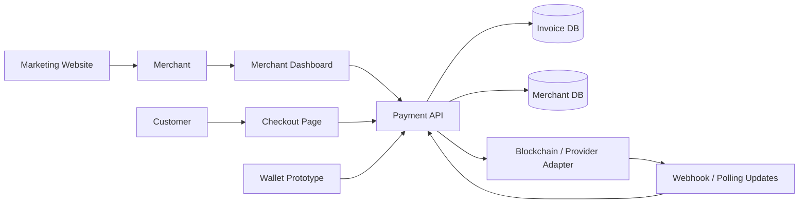

# Crypto Payment System Architecture

System-level architecture case study for a crypto payment platform: merchant dashboard, payment API, checkout page, wallet prototype, landing page, and provider integration boundaries.

This repository exists to show system ownership: how the product is decomposed, why the boundaries exist, what engineering risks matter, and which parts were designed and implemented by me. Service-level repositories are linked below as implementation details.

## 30-Second Overview

ZyraPayments is a crypto payment system for merchants. It lets a merchant create invoices, show customers a crypto checkout page, track payment status, and manage operations from a dashboard.

The hard part is not rendering a checkout form. The hard part is keeping payment state correct when external providers, blockchain confirmations, merchant retries, webhooks, and customer-facing timers all interact.

## Impact

- Built a crypto payments product architecture covering merchant operations, checkout, payment lifecycle, and wallet-facing flows.
- Designed invoice state handling for retries, delayed confirmations, and duplicate provider events.
- Created a merchant-facing dashboard model for payment visibility and operational analytics.
- Separated customer-facing checkout from lifecycle-critical payment API logic.
- Packaged the system into public-safe architecture and service-level showcases without exposing private payment logic.

## My Role

I built this system end-to-end as a founder/lead engineer and hands-on implementer.

I owned the product architecture, wrote the core code, defined service boundaries, designed lifecycle rules, and made the engineering decisions required to move from idea to a working payment platform.

My responsibilities included:

- defining the invoice lifecycle and state transitions;
- separating checkout, merchant dashboard, payment API, wallet UI, and marketing surface;
- designing idempotency and webhook-processing strategy;
- implementing key backend and frontend flows with TypeScript, Next.js, Node.js, Express, and MySQL;
- designing merchant-facing API contracts and dashboard data models;
- handling production risks around retries, duplicate events, expiration races, and provider instability;
- documenting API contracts, trade-offs, and operational concerns.

## System Diagram

## Services

| Service | Responsibility | Public Repo |
|---|---|---|
| Landing | Product positioning and marketing surface | [zyra-landing-showcase](https://github.com/MihichN/zyra-landing-showcase) |
| Merchant Dashboard | Merchant operations, analytics, invoices, settings | [zyra-merchant-dashboard-showcase](https://github.com/MihichN/zyra-merchant-dashboard-showcase) |
| Checkout | Customer-facing invoice/payment flow | [zyra-checkout-showcase](https://github.com/MihichN/zyra-checkout-showcase) |
| Payment API | Invoice lifecycle, idempotency, provider updates | [zyra-payment-api-showcase](https://github.com/MihichN/zyra-payment-api-showcase) |
| Wallet Prototype | Wallet-oriented UI and balance/address flows | [zyra-wallet-showcase](https://github.com/MihichN/zyra-wallet-showcase) |
| System Showcase | High-level product and architecture summary | [crypto-payments-gateway-showcase](https://github.com/MihichN/crypto-payments-gateway-showcase) |

## Why This Architecture

### Why not one monolith?

A monolith would be faster for the first prototype, but payments have different operational surfaces:

- checkout must be customer-facing and resilient;
- dashboard is merchant-facing and analytics-heavy;
- API owns lifecycle correctness;
- provider/webhook logic has very different failure modes;
- marketing site should deploy independently.

Splitting these areas makes the product easier to reason about and safer to evolve.

### Why an explicit invoice state machine?

Payment systems receive late, duplicate, and out-of-order events. A state machine makes terminal states explicit and prevents accidental overwrites such as changing `paid` back to `expired`.

### Why idempotency?

Merchant systems retry after timeouts. Without idempotency, a single order can create multiple invoices. The API contract requires an idempotency key for invoice creation.

## Key Engineering Problems

### Idempotent Invoice Creation

Problem: merchant retries can create duplicate invoices.

Solution: bind `Idempotency-Key` to merchant + payload hash and return the same result for safe retries.

### Webhook Race Conditions

Problem: webhook updates, polling, expiration jobs, and customer refreshes can touch the same invoice lifecycle.

Solution: route all events through the same transition layer and treat terminal states as immutable.

### Provider Isolation

Problem: blockchain/provider APIs are unstable and provider-specific.

Solution: isolate provider logic behind adapters so invoice lifecycle code remains provider-agnostic.

### Dashboard Data Quality

Problem: merchants need reliable totals and status counts, not raw provider payloads.

Solution: normalize backend responses into dashboard view models and document metric semantics.

### Secrets and Key Handling

Problem: payment systems involve API keys, webhook secrets, private keys, RPC credentials, and merchant data.

Solution: secrets are excluded from public repos; production credentials stay in private environment/configuration.

## Failure Scenarios I Designed For

- Merchant retries invoice creation after a timeout.
- Provider sends duplicate webhook events.
- Customer pays close to invoice expiration time.
- Webhook arrives after invoice is already terminal.
- Blockchain/provider confirmation is delayed.
- Dashboard totals drift from payment ledger semantics.
- Provider API becomes unavailable during checkout status polling.

Each scenario can create real merchant-facing inconsistencies if invoice lifecycle rules are not explicit.

## Deep Dive: Payment Idempotency and State

One of the hardest problems was designing invoice state so payment operations remain correct under retries and asynchronous provider updates.

Challenges:

- merchants retry requests after network failures;
- provider events can arrive late or more than once;
- expiration jobs can race with confirmations;
- checkout pages need fast status reads;
- dashboard analytics depend on consistent payment semantics.

Solution:

- invoice status is modeled as an explicit state machine;
- terminal states such as `paid` and `expired` are protected;
- invoice creation requires idempotency semantics;
- provider/webhook logic is isolated from lifecycle rules;
- dashboard data is derived from normalized invoice state.

Trade-off:

- strict lifecycle modeling adds upfront complexity, but prevents ambiguous payment states later.

Result:

- the system can tolerate merchant retries and provider event delays without creating duplicate or contradictory invoice states.

## Trade-Offs

| Decision | Benefit | Cost |
|---|---|---|
| Separate checkout and dashboard | Safer deployments, clearer UX ownership | More repos/services to coordinate |
| State machine for invoices | Correctness under race conditions | More upfront modeling |
| Provider adapters | Easier provider changes | Adapter contract must be maintained |
| OpenAPI contracts | Better integration clarity | Requires contract discipline |
| Public showcase repos | Demonstrates architecture safely | Full production code remains private |

## Production Risks

Key risks in this system:

- duplicate invoice creation from merchant retries;
- late or duplicate provider events;
- incorrect terminal state transitions;
- unsafe merchant access across account boundaries;
- provider outage during active checkout sessions;
- dashboard analytics showing misleading financial totals.

Mitigation included:

- idempotency keys;
- state-machine-based invoice lifecycle;
- provider event deduplication;
- merchant-scoped access control;
- webhook verification strategy;
- reconciliation and observability around confirmation lag.

## Approximate Scale Targets

Public-safe target assumptions:

- checkout API latency target: p95 under 300 ms for cached/read paths;
- invoice creation should be idempotent and safe under retries;
- webhook processing should be asynchronous/retryable;
- dashboard analytics should move to precomputed views as merchant volume grows.

Exact production metrics are not published for confidentiality reasons.

## Public vs Private

Public repositories include:

- architecture diagrams;
- API contracts;
- ADRs;
- production considerations;
- sanitized examples;
- tests and CI.

Private production repositories include:

- real provider integrations;
- merchant data;
- private keys and webhook secrets;
- production schemas and deployment configuration;
- full business logic.

## Recommended Reading Order

1. [Payment API](https://github.com/MihichN/zyra-payment-api-showcase) - lifecycle, idempotency, OpenAPI.
2. [Merchant Dashboard](https://github.com/MihichN/zyra-merchant-dashboard-showcase) - analytics and view models.
3. [Checkout](https://github.com/MihichN/zyra-checkout-showcase) - customer-facing payment flow.
4. [Wallet](https://github.com/MihichN/zyra-wallet-showcase) - wallet UI foundation.
